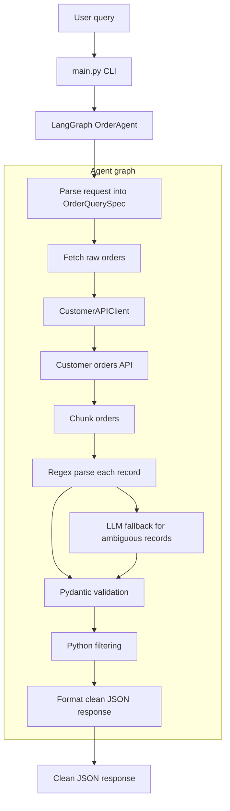

# Order Parsing Agent

Python LangGraph agent for the Raft take-home challenge. It accepts a natural-language order request, fetches unstructured order text from the provided customer API, parses and validates records, then returns deterministic JSON.

- Natural-language entrypoints: CLI and optional Flask UI.
- Parsing strategy: regex-first, with constrained OpenRouter `openai/gpt-oss-120b:exacto` fallback for ambiguous records.
- Validation and safety: Pydantic models, deterministic filter merging, and no raw payload logging.
- Edge-case handling: chunked parsing, schema-tolerant API extraction, LLM conflict handling, and request-correlated logs.
- Extras: browser UI, simple sklearn regression demo, adjustable chunk size, and GitHub Actions CI.

## Quick Start
Install dependencies:

```bash
python3 -m pip install -r requirements.txt
```

Start the provided customer API in one terminal:

```bash
python3 dummy_customer_api.py
```

Run the agent in another terminal:

```bash
python3 main.py --query "Show me all orders where the buyer was located in Ohio and total value was over 500"
```

The dummy API must be running separately because it represents the customer service the agent calls. The agent still runs without `OPENROUTER_API_KEY`; it uses deterministic parsing and skips LLM fallback.

## Run UI
Use two terminals:

```bash
python3 dummy_customer_api.py
```

```bash
python3 main.py --ui
```

Open `http://127.0.0.1:8000`. Port `5001` is only the mock customer API; port `8000` is the UI.

## Architecture


The agent first extracts filters from the user query, fetches raw order text, chunks records to avoid context-window pressure, parses with deterministic regex rules, and uses the LLM only as a repair path when records are ambiguous. Final output is validated and filtered in Python before JSON formatting.

## Challenge Coverage
- Natural-language request: `main.py --query` and `main.py --ui`.
- API fetch: `CustomerAPIClient` reads from `ORDER_API_BASE_URL`.
- Structured parsing: regex parser, constrained LLM repair, and Pydantic validation.
- Hallucination control: deterministic parsing wins over conflicting LLM fields; missing/uncertain repaired fields are rejected.
- Schema drift: API client accepts `raw_orders`, `orders`, and nested `data`/`result`/`results` payloads.
- Context overflow: raw records are processed in configurable chunks.
- Output: deterministic `{"orders": [...]}` JSON.

## Configuration
Optional local settings:

```bash
cp .env.example .env.local
```

- `OPENROUTER_API_KEY`: enables LLM fallback.
- `OPENROUTER_BASE_URL`: defaults to OpenRouter.
- `ORDER_API_BASE_URL`: defaults to `http://localhost:5001`.
- `LOG_LEVEL`: defaults to `INFO`; use `DEBUG` for more detail.

Per-run logging example:

```bash
python3 main.py --log-level DEBUG --query "Show all orders"
```

Logs include a short `request_id` so CLI queries and UI submissions can be traced across components.

## Extras
- UI: `python3 main.py --ui`
- Regression demo: `python3 main.py --query "Show all orders" --predict-total-for-items 2`
- Chunking: `--chunk-size 25`, also adjustable in the UI.
- API smoke test: `curl http://127.0.0.1:5001/api/orders`

## Test
```bash
python3 -m pytest
```

CI runs the same pytest suite on pushes and pull requests.
