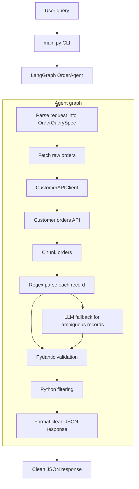

# Order Parsing Agent

This project implements a Python-based LangGraph agent that:
- accepts a natural-language query
- fetches raw order text from the provided customer API
- parses records with a regex-first strategy
- falls back to OpenRouter `openai/gpt-oss-120b:exacto` for ambiguous records
- validates every parsed record with Pydantic
- applies filtering in Python and returns deterministic JSON

## Architecture


## Setup
1. Install dependencies:
   ```bash
   python3 -m pip install -r requirements.txt
   ```
   If you already had a virtual environment before pulling new changes, run this
   command again so newly added packages such as `scikit-learn` are installed.
2. Start the dummy API:
   ```bash
   python3 dummy_customer_api.py
   ```
   To smoke-test the API in a browser or with `curl`, open:
   ```text
   http://127.0.0.1:5001/api/orders
   ```
   Opening `http://127.0.0.1:5001/` returns a short endpoint list.
   Browser requests for `/favicon.ico` are answered with no content so the
   development log stays clean.
3. Configure environment:
   ```bash
   cp .env.example .env.local
   # Edit .env.local with your API settings.
   ```

The agent can still run without `OPENROUTER_API_KEY`, but it will use deterministic parsing only and skip LLM fallback.

## Run
```bash
python3 main.py --query "Show me all orders where the buyer was located in Ohio and total value was over 500"
```

To see more detailed local logs for a single run, pass `--log-level DEBUG`:
```bash
python3 main.py --log-level DEBUG --query "Show all orders"
```

You can also set the default in `.env.local`:
```text
LOG_LEVEL=DEBUG
```

Logs include a short `request_id` so messages from the same CLI query or UI
form submission can be traced together:
```text
2026-04-15 10:30:00,000 | INFO | request_id=7f3a21c9 | order_agent.agent | Finished agent run; elapsed_ms=12.34 final_order_count=3
```

## Regression demo
For a small traditional ML baseline, add `--predict-total-for-items` to train an
`sklearn.linear_model.LinearRegression` model on the parsed orders from the
current API response. This is a demonstration feature for the coding challenge,
not a production forecast.

```bash
python3 main.py --query "Show all orders" --predict-total-for-items 2
```

## Run UI
Use two terminals: one for the dummy customer API and one for the UI.

Terminal 1 starts the dummy API on port `5001`:
```bash
python3 dummy_customer_api.py
```

Terminal 2 starts the browser UI on port `8000`:
```bash
python3 main.py --ui
```

Open the UI in your browser:
```text
http://127.0.0.1:8000
```

Do not use `http://127.0.0.1:5001` for the UI. Port `5001` is only the mock
customer API that the agent reads from.

The UI also includes an optional "Predict total" field. Enter an item count to
include the same sklearn regression demo in the rendered results and JSON.

## Test
```bash
python3 -m pytest
```

## CI
This repository includes a lightweight GitHub Actions workflow that runs on
pushes and pull requests. The workflow installs dependencies and runs the test
suite with `pytest`, covering the parser, agent behavior, CLI, UI routes, and
regression demo without adding unnecessary deployment infrastructure for this
take-home project.
